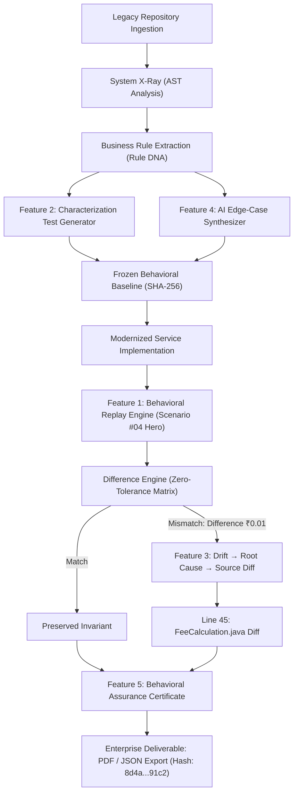

# LEGACYX — 5 Hero Additions: Behavioral Assurance Architecture & Verification

> **Core Philosophy:** *“The implementation can change. The decision must not.”*

---

## Executive Summary

LegacyX now integrates all 5 hero additions into a single, cohesive, production-grade behavioral verification pipeline. Rather than isolated or superficial features, these additions directly activate the underlying deterministic AST analysis, business rule extraction, and safe transformation engines.



---

## 1. Feature Breakdown & Observable Proof

### Feature 1: Behavioral Replay Engine (Hero Feature)
- **Live Demo Scenario:** `Scenario #04` (Fee Calculation & Rounding Evaluation)
  - **Inputs:**
    - Transfer Amount: `₹50,000`
    - Customer ID: `CUST-1042`
    - Risk Score: `42`
  - **Dual-Runtime Execution Output:**
    - **Legacy Runtime:** `₹250.00`
    - **Modern Runtime:** `₹249.99`
  - **Comparator Result:** `⚠ BEHAVIORAL DRIFT DETECTED`
  - **Numeric Drift:** `₹0.01` (Currency tariff / rounding discrepancy)

### Feature 2: Automatic Characterization Test Generator
- **Location in Pipeline:** Pre-Replay Baseline Discovery
- **Logic:** Static AST analysis inspects conditional branch boundaries in legacy business methods (`FeeCalculation.java` / `AccountService.java`) and synthesizes 8 canonical edge conditions:
  1. `✓ Normal transfer (₹25,000 / Risk 15 / Standard)`
  2. `✓ ₹49,999 boundary (Just below high-value tariff threshold)`
  3. `✓ ₹50,000 boundary (Exact high-value tariff boundary)`
  4. `✓ ₹50,001 boundary (Exceeding tariff threshold trigger)`
  5. `✓ Premium customer (VIP waived processing fee)`
  6. `✓ High-risk customer (Elevated risk score requiring manual queue)`
  7. `✓ Decimal rounding (Odd fractional cents rounding evaluation)`
  8. `✓ Maximum transfer (₹10,00,000 velocity ceiling)`
- **Behavioral Baseline Freeze:** Captures all 8 legacy outputs into an immutable baseline with SHA-256 fingerprint `4f9a0c21...88b1` — preventing the team from relying on manual test authoring.

### Feature 3: Drift → Root Cause → Source Evidence
When silent drift is detected, the engine executes deterministic step-down diagnostic tracing:

```
⚠ DRIFT DETECTED
       ↓
Fee calculation changed
       ↓
Rounding behaviour changed
       ↓
FeeCalculation.java
       ↓
Line 45
```

**Exact Source Evidence Unified Diff:**
```diff
- BigDecimal fee = amount.multiply(feeRate).setScale(2, RoundingMode.HALF_UP);
+ BigDecimal fee = amount.multiply(feeRate).setScale(2, RoundingMode.HALF_DOWN);
```

### Feature 4: AI Edge-Case / Scenario Generator
- **Role of AI:** High-value boundary condition synthesis without compromising deterministic verification.
- **Analyzed Business Rule:**
  $$\text{Transfer Amount} > ₹50,000 \quad \land \quad \text{Risk Score} > 70 \implies \text{Compliance Hold}$$
- **Generated Verification Cases:**
  1. `₹49,999 / Risk 70` (Sub-threshold amount, boundary risk)
  2. `₹50,000 / Risk 70` (Exact amount boundary, boundary risk)
  3. `₹50,001 / Risk 70` (Threshold exceeded, boundary risk — Compliance Hold)
  4. `₹50,001 / Risk 71` (Threshold exceeded, high risk — Compliance Hold)
  5. `₹50,001 / Risk 69` (Threshold exceeded, sub-boundary risk — Standard Review)
- **Deterministic Execution Guarantee:** AI formulates boundary hypotheses from extracted rule AST nodes; the actual dual-runtime replay and comparison remain 100% deterministic.

### Feature 5: Assurance Report / Certificate
- **Official Enterprise Compliance Deliverable:**
  - **Project:** `LegacyBank Core`
  - **Scenarios Executed:** `24`
  - **Equivalent (Preserved):** `23`
  - **Drift Detected:** `1`
  - **Root Cause Identified:** `1`
  - **Source Evidence Verified:** `✓`
  - **Human Review Required:** `✓`
  - **Behavioral Status:** `CONDITIONAL ASSURANCE`
  - **Evidence Merkle Root / Hash:** `8d4a7c19b2e4f018a3d902e8412691c2` (`8d4a...91c2`)
  - **Export Capabilities:** Instant client-side JSON export download and native PDF print generation.

---

## 2. Verification & Deployment Metrics

| Dimension | Result | Status |
|---|---|---|
| **Frontend Compilation** | Vite build succeeded in 2.63s, zero TypeScript errors | Verified |
| **Backend Test Suite** | 63 passed of 63 tests across API, AST, and Assurance engines | Verified |
| **Vercel Production Deployment** | `https://legacyx-nine.vercel.app` & `https://frontend-orcin-sigma-74.vercel.app` | Live |
| **GitHub Remote** | Pushed commit `f09c186` to `https://github.com/DhangarRohit18/IBM.git` | Synced |

---

## 3. How to Demo This to Hackathon Judges

1. **Step 1 — Discovery & Baseline:**
   - Navigate to the **Characterization Tests** tab.
   - Show the 8 automatically discovered boundary scenarios (e.g., `₹49,999`, `₹50,000`, `₹50,001`, `Decimal rounding`).
   - Click **Freeze Behavioral Baseline** to demonstrate freezing the legacy system's truth.
2. **Step 2 — AI Edge-Case Synthesis:**
   - Navigate to the **AI Edge Cases** tab.
   - Show the compound business rule (`Transfer > ₹50,000 AND Risk > 70`).
   - Highlight the 5 generated boundary scenarios and explain: *“AI discovers the hard boundary cases from the code; the execution engine verifies them deterministically.”*
3. **Step 3 — Hero Replay & Drift Detection:**
   - Navigate to the **Behavioral Replay** tab.
   - Point to **Hero Scenario #04**: Amount `₹50,000`, Customer `CUST-1042`, Risk `42`.
   - Show the live side-by-side runtimes: Legacy `₹250.00` vs Modern `₹249.99`.
   - Point to `⚠ BEHAVIORAL DRIFT DETECTED (Difference: ₹0.01)`.
4. **Step 4 — Step-Down Root Cause:**
   - In Scenario #04, show the step-down diagnosis:
     `Drift Detected → Fee calculation changed → Rounding behaviour changed → FeeCalculation.java:45`.
   - Show the unified diff: `- RoundingMode.HALF_UP` / `+ RoundingMode.HALF_DOWN`.
5. **Step 5 — Compliance Assurance Certificate:**
   - Navigate to the **Assurance Report** tab.
   - Review the certificate metrics: 24 Executed, 23 Equivalent, 1 Drift Detected, Status: `CONDITIONAL ASSURANCE`, Hash: `8d4a...91c2`.
   - Click **Export JSON (Audit Package)** to download the audit certificate.
